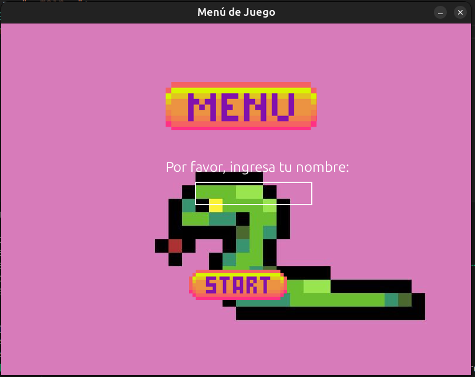
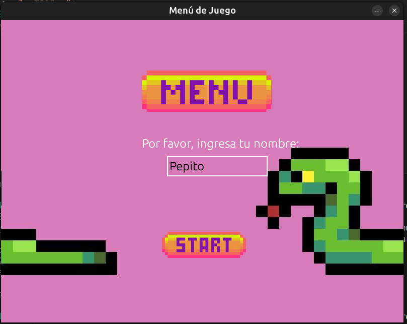
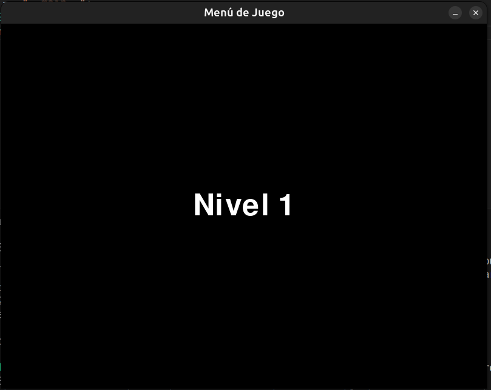
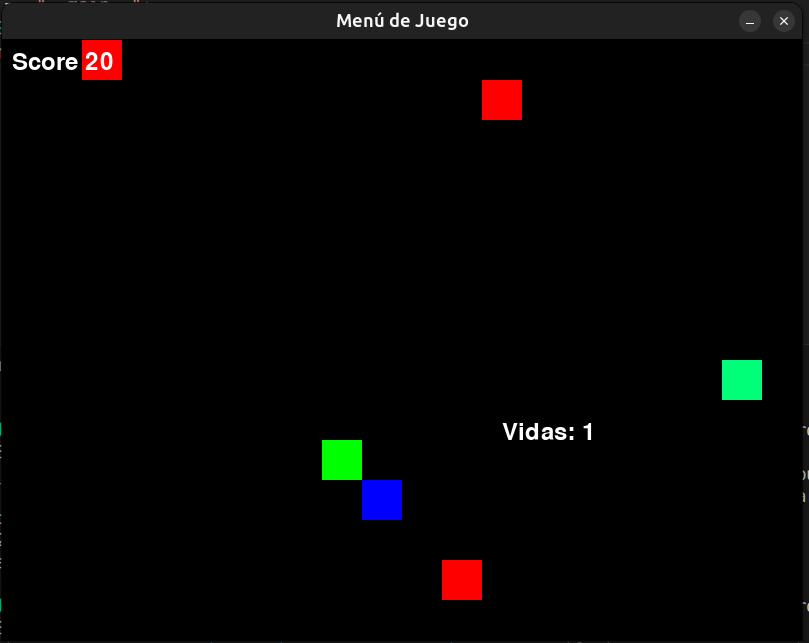

# ExamenParcial_CC3S2A






# Reglas del juego
- El juego está diseñado para mover el snake usando las teclas de (derecha e izquierda / arriba y abajo)
- Como jugador cuentas con un score y dos vidas 
- Por cada comida (azul) aumenta el tamaño del snake y aumenta tu score a 10 puntos 
- Existen powerups (turquesa) que aumentan tu score al doble de cada comida.  
- Existen obstaculos cuyo proposito es agregarle complejidad al juego, estos obstaculos quitan vida al snake cuando colisionas con los obstaculos
- Cada 50 puntos pasas al siguiente nivel 
- Cada nivel cuenta con mas obstaculos agregando complejidad al juego.
- Al entrar te va pedir registrarte (No te permitira jugar sin colocar nombre en el juego) 


# ¿Cómo Jugar?

### Paso 1: Clonar el repositorio
1. Abre una terminal en tu computadora.
2. Usa el siguiente comando para clonar el repositorio del proyecto:
   ```bash
   git clone https://github.com/lautaroballesteros0926/ExamenParcial_CC3S2A
   ```

3. Una vez clonado, navega dentro de la carpeta del proyecto:
   ```bash
   cd nombre_del_repositorio
   ```

### Paso 2: Crear un entorno virtual
1. Crea un entorno virtual en el directorio del proyecto. Esto aísla las dependencias del proyecto:
   ```bash
   python -m venv env
   ```

2. Activa el entorno virtual:
   - **En Windows**:
     ```bash
     .\env\Scripts\activate
     ```
   - **En macOS/Linux**:
     ```bash
     source env/bin/activate
     ```

3. Instala las dependencias necesarias que están listadas en el archivo `requirements.txt`:
   ```bash
   pip install -r requirements.txt
   ```
### Paso 3: Ejecutar el archivo main.py 
Abre una terminal ubicate en la carpte raiz, del proyecto y ejecuta el siguiente comando: 

    ```bash
    python main.py 
    ```

### Dockerización de la aplicación
Se crean los contenedores correspondientes : 


# Requerimientos del juego completadas 
Integración de herramientas:
 - GitHub: Ramas para movimiento, power-ups y obstáculos. (completado)
 - GitHub Actions: Pruebas automatizadas y despliegue continuo. (completado)
 - Docker: Contenerización del juego para distribución.(completado)
 - BDD con Behave: Definir comportamientos de power-ups y obstáculos. (completado)
 - Grafana y Prometheus: Seguimiento de estadísticas del juego (opcional) (No completado por conflicto y falta de tiempo)

 Recomendamos revisar nuestro Kanban para un mayor seguimiento del flujo de trabajo de nuestro proyecto. 